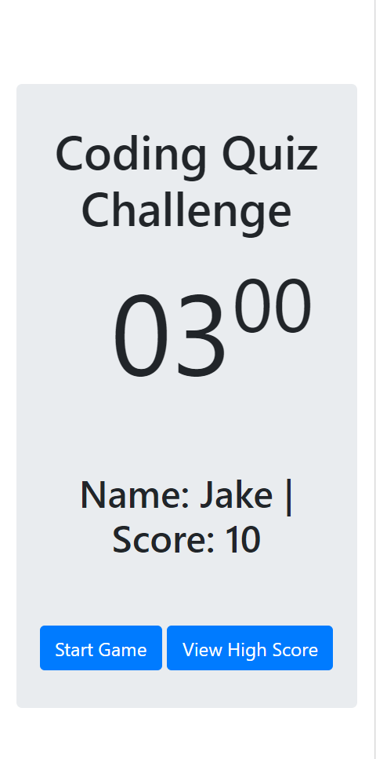
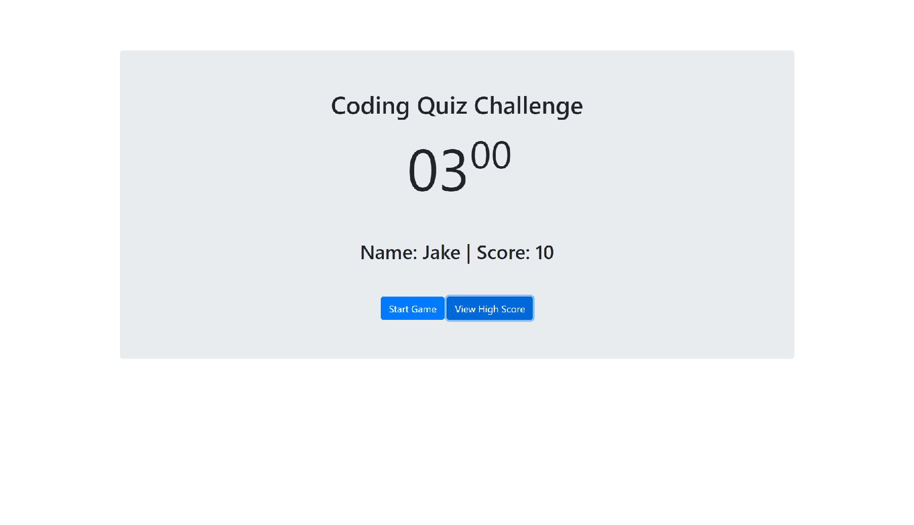

# Overview
This is a quiz game based on a series of questions the user should be able to answer if they have completed the 3rd and 4th week of the university of utah coding bootcamp.

In this assignment I learned how to create a timer and create a list of questions stored in an object and put into an array.

## Instructions

the game will begin once the start game button is clicked

once the timer reaches zero the clock will reset back to 3 minutes and the game will be over.

When all of the questions have been answered the game will be over and the timer will reset back to 3 minutes resting.

each question give you a point. getting an answer wrong in this version of the game rewards no penalty other than granting no point.

after the game is over the game will ask for your name and save you name and score to local storage.
when you click on view high scores the game will display the last score... I could not get multiple users saved to local storage.

